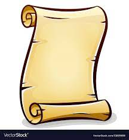

<p align="center">
 
</p>

<br />

[]()
[]()
[]()
[](https://github.com/prettier/prettier)
[](#contributors-)
[]()

> The easiest way to implement scroll anchors

The library provides a simple and reusable solution for creating scroll anchors and carousels.

## Demo


<br>


## Installation

`npm install @ritox/scroll-manager`

## Usage

Add the `rtxScrollManager` directive to the container element. Add the `rtxScrollSection` directive to element you want
to scroll to. Add the `rtxScrollAnchor` directive to element you want to click on in order to trigger a scroll event.

<!-- prettier-ignore -->

```html

<main rtxScrollManager>
    <nav>
      <button rtxScrollAnchor="A-H">First Article</button>
      <button rtxScrollAnchor="B-H">Second Article</button>
      <button rtxScrollAnchor="C-H">Third Article</button>
      <button rtxScrollAnchor="D-H">Forth Article</button>
    </nav>

    <div>
      <article rtxScrollSection="A-H">
        <!--some content-->
      </article>

      <article rtxScrollSection="B-H">
        <!--some content-->
      </article>

      <article rtxScrollSection="C-H">
        <!--some content-->
      </article>

      <article rtxScrollSection="D-H">
        <!--some content-->
      </article>
    </div>
</main>
</div>
```

With this setup, we defined anchors using `rtxScrollAnchor` and passing to it a unique id.
We add `rtxScrollAnchor` to the desired scrollable elements and pass the exact unique id as for the corresponding anchor.

## rtxScrollManager Definition

### `rtxScrollOptions`

Allow you to pass `ScrollIntoViewOptions` that will be used by `scroll-manager` lib.
The defaults are:
<br>
<code>{<br>
 &nbsp; behavior: 'smooth',<br>
 &nbsp; block: 'end',<br>
 &nbsp; inline: 'nearest',<br>
}
</code>

## rtxScrollSection Definition

#### `rtxScrollSection`
A unique id for identifying the corresponding anchor.

### `rtxScrollOptions`
Allows you to override the `ScrollIntoViewOptions` inherit values for this specific section. 


## rtxScrollAnchor Definition

#### `rtxScrollAnchor`
A unique id for identifying the corresponding scroll section.

## Browser Support

Supports all modern browsers.

## Contributors ✨

Thanks goes to these wonderful people ([emoji key](https://allcontributors.org/docs/en/emoji-key)):

<!-- ALL-CONTRIBUTORS-LIST:START - Do not remove or modify this section -->
<!-- prettier-ignore-start -->
<!-- markdownlint-disable -->
<table>
  <tr>
    <td align="center"><a href="https://github.com/ritox842"><br /><sub><b>Gili Yaniv</b></sub></a><br /><a href="https://github.com/@ritox842/scroll-manager/commits?author=ritox842" title="Code">💻</a> <a href="#content-ritox842" title="Content">🖋</a> <a href="https://github.com/@ritox842/scroll-manager/commits?author=ritox842" title="Documentation">📖</a> <a href="#ideas-ritox842" title="Ideas, Planning, & Feedback">🤔</a> <a href="#infra-ritox842" title="Infrastructure (Hosting, Build-Tools, etc)">🚇</a> <a href="#maintenance-ritox842" title="Maintenance">🚧</a> <a href="https://github.com/@ritox842/scroll-manager/pulls?q=is%3Apr+reviewed-by%3Aritox842" title="Reviewed Pull Requests">👀</a></td>
  </tr>
</table>

<!-- markdownlint-restore -->
<!-- prettier-ignore-end -->

<!-- ALL-CONTRIBUTORS-LIST:END -->

This project follows the [all-contributors](https://github.com/all-contributors/all-contributors) specification.
Contributions of any kind welcome!

<div>Icons made by <a href="http://www.freepik.com/" title="Freepik">Freepik</a> from <a href="https://www.flaticon.com/" title="Flaticon">www.flaticon.com</a></div>
